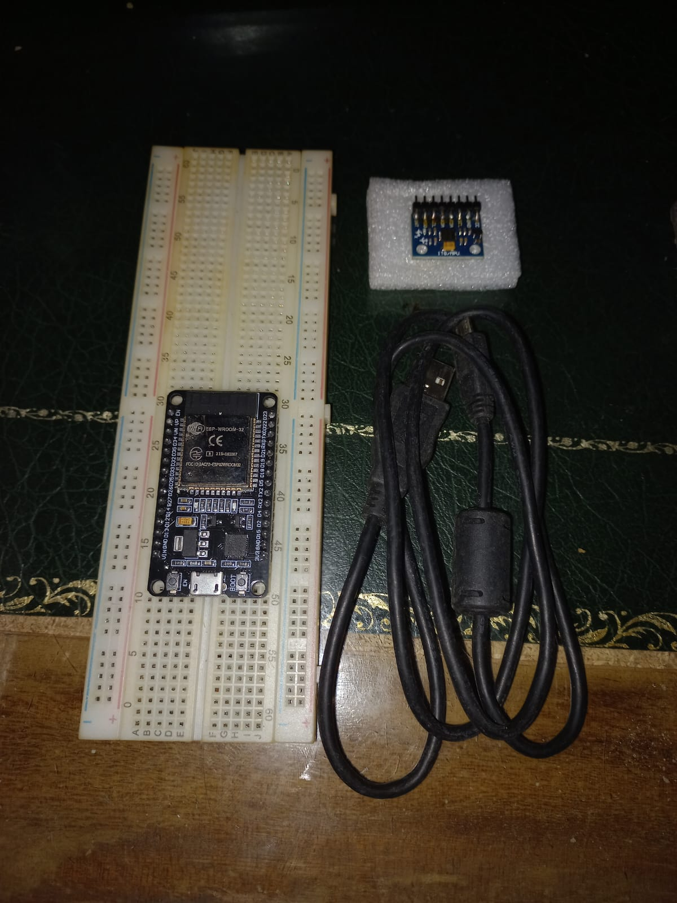

## 30-09-2026

**Actividades realizadas**

* Recepción de los materiales provistos por la cátedra para el desarrollo del proyecto:
  * Placa de desarrollo ESP32
  * Módulo sensor MPU6050
  * Protoboard
  * Cable USB
* Verificación física de los componentes recibidos.

## 01-10-2026

**Actividades realizadas**

* Montaje del circuito en protoboard conectando el ESP32 con el MPU6050 vía I2C.
* Configuración del entorno de desarrollo en PlatformIO.
* Desarrollo y ejecución de 4 tests unitarios/funcionales:
  * **Test I2C:** Verificación de comunicación exitosa y detección de ID correspondiente a MPU6050 original (dirección `0x68`).
  * **Test de lectura cruda:** Adquisición continua a 100 Hz estables con un jitter de ±1 µs.
  * **Test de calibración:** Medición de la deriva del giróscopo, registrando 30°/min sin corregir y reduciéndose a menos de 1°/min tras aplicar compensación de bias.
  * **Test de Madgwick:** Validación del filtro con un tiempo de cómputo de 25 µs por muestra, adoptando un factor $\beta = 0.1$.

**Pendientes**

* Validar los ángulos de pitch y roll contrastando contra inclinómetro físico.
* Cuantificar la deriva en el eje yaw.
* Iniciar el desarrollo de la lógica para la estimación del desplazamiento lineal.
